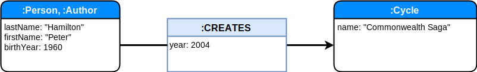

class: inverse middle
# Notes

## Basic notions for graphs

- node
- relationship
- properties
- label
- traversals
- path


---

class: inverse middle center

# Notions de base

---
name: notion_de_base_node
# Node

Un `Node` est une **entité**

---
template: notion_de_base_node

<center>
  
</center>

Avec

---
template: notion_de_base_node

<center>
  
</center>

Avec
* des **propriétés** 


---
template: notion_de_base_node

<center>
  
</center>

Avec
* des propriétés 
* un **label** 

Un label est une étiquette apposé sur le noeud.

---
template: notion_de_base_node

<center>
  
</center>


Avec
* des propriétés 
* un ou **plusieurs labels** 

Les labels servent également à l'indexation.

---
name: notion_de_base_relationship

# Relationship

Une `relationship` est une **entitée**


---
template: notion_de_base_relationship

<center>
  
</center>

Avec
* un noeud de **départ** et un noeud d'**arrivé**


---
template: notion_de_base_relationship

<center>
  
</center>

Avec
* un noeud de départ et un noeud d'arrivé
* un et un seul **type**

---
template: notion_de_base_relationship

<center>
  
</center>

Avec
* un noeud de départ et un noeud d'arrivé
* un et un seul type
* et des **propriétés**


---
# Node et Relationship

## First-Class Citizen

Les deux types sont de la même importance, il n'y a pas d'entité privilégiée par rapport à une autre, comme la table définie en SQL et la jointure comme un moyen de relier les tables.

--

## Instance vs classe

Chaque entité est autonome dans sa définition. Il n'y a pas de **schéma dans la base** qui décrit ce qu'est un auteur ou un livre.

<center>
	
</center>

---

class: inverse middle center

# Présentation de Neo4j

---

# Licences

Il y a plusieurs modèles de licences, 


## Neo4j Community Edition

* GPL v3 license

.quote[If you’re building an application that accesses a Neo4j database running inside your organization (or on any personal device), then you are free to use Community Edition, whether or not your software is closed source.]


---

class: inverse middle center

# Cypher

---


## Cypher

```cypher
MATCH (p:Person {name: 'John'})-[r:LOVE]->(m:Person {name: 'Maria'})
RETURN p,r,m
```

## Graphs databases vs RDB 

---
# Application


## En mode apprentissage avec un conteneur Docker
* Plusieurs bases et un seul runtime

```bash
$ MY_BASE="$HOME/neo4j/sample"

docker run --rm \
--publish=7474:7474 \
--publish=7687:7687  \
--env=NEO4J_AUTH=none  \
--volume=$MY_BASE:/data  neo4j 
```

<a href="http://localhost:7474/browser/" target="_blank">Neo4J browser</a>

---
class: inverse middle center

Les exemples suivants  
sont extraits  
du cycle  


---
# Création de noeuds

* Le cycle
```cypher
CREATE (c:Cycle {name: "La Passe-Miroir"}) RETURN c
```
<center>
<pre>
╒══════════════════════════╕
│"a"                       │
╞══════════════════════════╡
│{"name":"La Passe-Miroir"}│
└──────────────────────────┘
</pre>
</center>

* L'auteur
```cypher
CREATE (a:Author {name: "Christelle Dabos"}) RETURN a 
```
<center>
<pre>
╒═══════════════════════════╕
│"a"                        │
╞═══════════════════════════╡
│{"name":"Christelle Dabos"}│
└───────────────────────────┘
</pre>
	
</center>


---
name: creation_relation_author_cycle

# Création de la relation

```cypher
MATCH (a:Author {name:"Christelle Dabos"}), (c:Cycle { name:"La Passe-Miroir"}) 
CREATE (a)-[r:CREATES]->(c) 
RETURN a, r, c
```

---
template: creation_relation_author_cycle

<center>
	
</center>


---
template: creation_relation_author_cycle


<center>
<pre>
╒═══════════════════════════╤═══╤══════════════════════════╕
│"a"                        │"r"│"c"                       │
╞═══════════════════════════╪═══╪══════════════════════════╡
│{"name":"Christelle Dabos"}│{} │{"name":"La Passe-Miroir"}│
└───────────────────────────┴───┴──────────────────────────┘
</pre>	
</center>

---
# Création de plusieurs noeuds seuls

```cypher
CREATE 
(:Book {volume:1, name:"Les Fiancés de l'hiver", editionYear: 2013}),
(:Book {volume:2, name:"Les Disparus du Clairdelune", editionYear: 2015}),
(:Book {volume:3, name:"La Mémoire de Babel", editionYear: 2017 })
```

# Retrouver les noeuds

```cypher
MATCH (ldap {name: 'ldap'}), (dns {name:'dns'}) RETURN ldap, dns
```

<pre>
╒═══════════════╤══════════════╕
│"ldap"         │"dns"         │
╞═══════════════╪══════════════╡
│{"name":"ldap"}│{"name":"dns"}│
└───────────────┴──────────────┘	
</pre>


---
# Chargement Load CSV

Il est possible de charger des données en CSV, à condition d'avoir données assez propres, et jusqu'à 10 Mo

```cypher
LOAD CSV WITH HEADERS FROM "https://data.enseignementsup-recherche.gouv.fr/explore/dataset/fr-esr_referentiel_metier_referens_3/download/?format=csv&timezone=Europe/Berlin&use_labels_for_header=true" AS line FIELDTERMINATOR ';'
MERGE 
(bap:BAP 
  {code: line.\`Code de la branche d’activité professionnelle`,
   label: line.\`Branche d’activité professionnelle`}
)
MERGE (codeEmploiType:EmploiType {
  code: line.\`Code emploi type`,
    label: line.\`Intitulé de l’emploi type`
})
MERGE (codeEmploiType)-[:IS_IN]->(bap)
    
return bap, codeEmploiType
```

Pour les gros volumes, il faut utiliser un outil
https://neo4j.com/developer/guide-import-csv/#_super_fast_batch_importer_for_huge_datasets


---
# Commandes utiles Browser Neo4J

* `:clear` : remove all frames 


---
# Questions

## Comment assurer l'unicité ?
## Comment supprimer 
## Comment charger avec du json
Ce n'est pas natif, il y a des extensions et un peu de bidouille pour cela
https://neo4j.com/blog/cypher-load-json-from-url/

---
# Inspirations

https://fr.slideshare.net/jexp/geekout-publish &hearts;

Faire des parallèles entre graph et cypher

.big[&#9398; &#8594; &#9399;]

https://unicode-table.com/en/search/?q=circled

internals: 
* https://fr.slideshare.net/thobe/an-overview-of-neo4j-internals
* https://www.slideshare.net/anikishaev/neo4j-after-1-year-in-production
* https://hackernoon.com/life-after-1-year-of-using-neo4j-4eca5ce95bf5

* https://image.slidesharecdn.com/neo4jinternals-120521030150-phpapp02/95/an-overview-of-neo4j-internals-12-728.jpg?cb=1337569396

Tuto
* https://stph.scenari-community.org/contribs/nos/Neo4j2/co/Neo4j-2.html
* https://blog.octo.com/bases-de-donnees-graphes-un-tour-dhorizon/
---
# Visualisation

3Djs : https://github.com/eisman/neo4jd3


---
# Neo4j and notebooks
https://blog.ouseful.info/2016/04/11/getting-started-with-the-neo4j-graph-database-linking-neo4j-and-jupyter-scipy-docker-containers-using-docker-compose/


---
# 


---
# Gephi et neo4j


---
# Utilité d'une base graphe

Connexion de plusieurs silos

---
# Les autres langages

* Cypher
* GraphQL
* gremlins